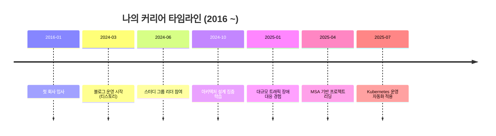
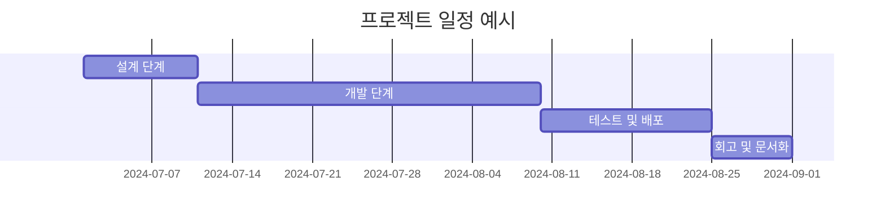

```mermaid
timeline
    title 나의 커리어 타임라인 (2016 ~)

    2016-01 : 첫 회사 입사
    2024-03 : 블로그 운영 시작 (티스토리)
    2024-06 : 스터디 그룹 리더 참여
    2024-10 : 아키텍처 설계 집중 학습
    2025-01 : 대규모 트래픽 장애 대응 경험
    2025-04 : MSA 기반 프로젝트 리딩
    2025-07 : Kubernetes 운영 자동화 적용
```

<!-- 프로젝트 설명하면서 기간 보여줄 때 사용하면 좋을 듯 -->
<!--

```mermaid
gantt
    title 프로젝트 일정 예시
    dateFormat  YYYY-MM-DD

    설계 단계       :a1, 2024-07-01, 10d
    개발 단계       :a2, after a1, 30d
    테스트 및 배포  :a3, after a2, 15d
    회고 및 문서화  :a4, after a3, 7d
```
-->
